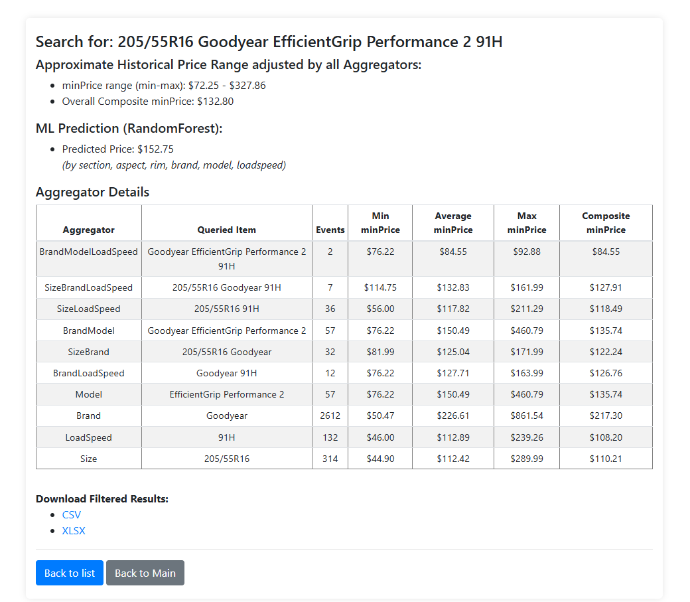

# Operator Tool
## Оглавление
- [Обзор](#обзор)
- [Опции](#опции)
- [Логика работы](#логика-работы) (User Flow)
- [Описание модулей](#описание-модулей)
- [Описание функций](#описание-функций)
- [Запуск](#порядок-выполнения-программы)
- [Требования](#требования)
- [Описание расчётов](#описание-расчётов)



## Обзор

Приложение для поиска и анализа исторических цен на шины. 

- Цель: Предоставить оператору удобный веб-интерфейс для быстрого поиска исторических цен на шины — как для одного продукта, так и для набора продуктов. 
- Результат опирается на различные aggregators (заданные группы атрибутов size, brand, model, loadspeed) и их приоритет.
- Приложение позволяет увидеть цены не только по строгому соответствию SBMLS, но и по частичному (например BLS - Goodyear 97Y)
- Также добавлена функция предсказаний цен по ML-модели RandomForest, на основе section, aspect, rim, brand, model, loadspeed.

- Источник данных: offers.csv - содержит данные по всем завалидированным офферам (offer\_*project\_*) начиная с июня 2024. Соответственно расчет ведется на основе лишь  очищенных минимальных цен по каждой завалидированной строке (модели).

\*источник данных при желании можно поменять на все отскрейпленные цены по каждой модели - оба варианта имеют свои плюсы и минусы

## Опции:
**Поиск одного продукта**

Введите параметры (Size, Brand, Model, LoadSpeed), чтобы получить:

- Агрегированные минимальные/средние/максимальные цены.
- Дополнительное предсказание цены с помощью ML-модели (Random Forest).

**Пакетная загрузка (Bulk)**

Загрузите CSV с несколькими строчками (каждая строчка содержит uid, size, brand, model, loadspeed). Приложение автоматически вычислит агрегированные цены и ML-прогноз для каждого товара.

**Система агрегаторов**

В конфигурационном файле aggregator_config.py заданы разные способы группировки (например, ["Size", "Brand", "Model"], ["Brand", "Model", "LoadSpeed"] и т.д.) с приоритетами. Итоговая цена определяется как взвешенное среднее по всем этим группировкам.

**ML-модель**

Заранее обученная модель RandomForest может предсказывать цену с учётом следующих признаков: size (section, aspect, rim), brand, model, load_speed.

(чтобы получить файл my_final_rf_model.joblib, необходимо запустить скрипт train_model.py) 
train_model.py -> my_final_rf_model.joblib

**Выгрузка результатов**

Результаты работы агрегаторов можно выгрузить в форматах CSV/XLSX (приложение генерирует их автоматически).

## Логика работы

**Старт приложения**
При запуске app.py вызывается init_data():
- Если файл offers.csv существует, он читается.
- Выполняется очистка данных (в том числе удаление выбросов).
- Вызывается create_aggregator_dataframes(...), формирующая специальную структуру для быстрого поиска.

**Главная страница (/, шаблон index.html)**
Отображает:
- Форму поиска для одного продукта (Size, Brand, Model, LoadSpeed).
- Форму загрузки CSV-файла (для пакетного поиска).

**Поиск одного продукта (POST → /search)**
- Считывает введённые поля (size, brand, model, load_speed).
- Выполняет поиск по агрегаторам и вычисляет взвешенную историческую цену (aggregated_search + predict_price_range).
- Опционально вызывает ML-модель (predict_price_with_rf), которая даёт предсказанную цену.
- Показывает результат в шаблоне results.html:
   - Минимальную/максимальную/композитную цену.
   - Предсказание ML-модели.
   - Подробную таблицу с разбивкой по каждому агрегатору.

**Загрузка CSV (POST → /upload_csv)**
- При загрузке файл сохраняется в папку data/.
- Считывается в глобальную переменную UPLOADED_DF.
- Отображается сводная статистика (число строк/столбцов, часто встречающиеся  значения и т.д.) в bulk_upload_info.html.

**Пакетные результаты (GET → /bulk_results)**
- Для каждой строки UPLOADED_DF запускается поиск по агрегаторам + расчёт взвешенной цены + ML-прогноз.
- Отображается таблица (bulk_results.html), содержащая:
   UID.
   “Full Product Name” (size + brand + model + load_speed).
   Взвешенную цену (Composite minPrice).
   ML-прогноз.

**Детальный просмотр товара (GET → /bulk_item/<uid>)**
- Ищет нужную строку в UPLOADED_DF по UID.
- Выполняет тот же поиск по агрегаторам и ML, что и при одиночном запросе.
- Выводит результат в шаблоне results.html в аналогичном формате.

**Скачивание (Download)**
- Любые сгенерированные CSV или XLSX-файлы можно загрузить по маршруту /download/<filename>.

## Описание модулей

### 1. `app.py`

Главный файл приложения Flask. Управляет маршрутами веб-интерфейса:

- `/` — Главная страница с формой поиска одного товара и загрузкой CSV.
- `/search` — Обрабатывает одиночный поиск, выводит исторические и ML-предсказания.
- `/upload_csv` — Принимает и обрабатывает загруженный CSV-файл.
- `/bulk_results` — Показывает таблицу результатов массового поиска.
- `/bulk_item/<uid>` — Детальная страница для конкретного товара из массовой загрузки.
- `/download/<filename>` — Скачивание файлов (CSV/XLSX).

## Структура программы

- **app.py** — основной сервер Flask, маршрутизация, передача данных в шаблоны.
- HTML-шаблоны — отображение интерфейса и результатов (`index.html`, `results.html`, `bulk_results.html`, `bulk_upload_info.html`).

- **services.py** — вся логика загрузки, очистки, агрегации и предсказания данных.
- **aggregator\_config.py** — конфигурация агрегаторов и приоритетов для расчета цен.
- **train\_model.py** — пример кода, используемого для обучения модели RandomForest и сохранения её для последующего использования.

## Описание функций:

- `load_and_clean_data(csv_path)` — Загрузка данных из CSV, очистка и удаление выбросов с помощью OneClassSVM, формирование колонок для агрегаторов.

- `create_aggregator_dataframes(df)` — Формирование сгруппированных данных для быстрого поиска по различным комбинациям полей (определения агрегаторов в aggregator\_config.py).

- `aggregated_search(agg_data, size, brand, model, load_speed)` — Поиск совпадений в агрегированных данных.

- `predict_price_range(matched_df)` — Расчёт взвешенных статистик (min/max/composite) по найденным агрегаторам.

- `process_results(matched_df, output_directory)` — Подготовка результатов поиска в удобный формат, сохранение CSV/XLSX.

- `describe_uploaded_data(df)` — Генерация описательной статистики загруженного CSV.

- `predict_price_with_rf(size_str, brand, model, load_speed)` — Предсказание цены с помощью предварительно обученной модели RandomForest.

## Порядок выполнения программы:

1. **Запуск приложения:**

   - Инициализация и загрузка данных (`offers.csv`).

2. **Использование:**

   - Пользователь вводит данные на главной странице или загружает CSV.
   - Веб-приложение обрабатывает запросы и вызывает соответствующие функции из `services.py`.

3. **Получение результатов:**

   - Результаты отображаются пользователю в HTML и могут быть скачаны в виде CSV или XLSX.

## Запуск:

```bash
python app.py
```

## Требования:

- Flask
- pandas
- numpy
- scikit-learn
- scipy
- statsmodels
- patsy

## Описание расчётов 

**minPrice range (min-max):**
Для каждого аггрегатора рассчитаны минимумы и максимумы minPrice
Для Approximate Historical Price Range считается среднее значение по всем аггрегаторам отдельно по минимумам и отдельно по максимумам - в результате получается adjusted range 

**Overall Composite minPrice**

- Сначала для каждого найденного аггрегатора расчитывается Composite minPrice *(медиана+среднее/2)*

- Далее рассчитваем среднее значение Composite minPrice относительно всех найденных аггрегаторов с учетом их весов:

Система распределения весов делится на два слоя:
1. В 1 слое каждому аггрегатору дается вес в зависимости от полноты соответствия полному названию модели:

По дефолту установлены значения для 1 слоя:
    "SBMLoadSpeed":        1.00,
    "SBM":                 0.90,
    "SizeBrandLoadSpeed":  0.70,
    "SizeBrand":           0.60,
    "BrandModelLoadSpeed": 0.70,
    "BrandModel":          0.60,
    "SizeLoadSpeed":       0.60,
    "Size":                0.30,
    "LoadSpeed":           0.30,
    "BrandLoadSpeed":      0.50,
    "Brand":               0.40,
    "Model":               0.45

*Значения можно настраивать вручную в файле aggregator_config.py*

2.  Во 2 слое больший вес отдается аггрегатору который встречался в исходных данных чаще


**ML Prediction (RandomForest)**

Цена предсказана на основе ML-модели RandomForestRegressor.
Для обучения модели использованы признаки: section, aspect, rim, brand, model, loadspeed.

Датасет предварительно очищен от аномально высоких и низких цен с помощью метода SVM

В результате сравнения нескольких ML-моделей с различными параметрами (GridSearchCV) , RandomForestRegressor показала наилучший результат, допустив ошибку в предсказании цены на тестовой выборке в 12.7% или $25.99.
---
Статистика ошибок RandomForestRegressor:
MAE:  25.99
MAPE: 0.127
MSE:  2003.07
RMSE: 44.76
R^2:  0.865

Параметры RandomForestRegressor: 
'model__n_estimators': 500, 
'model__min_samples_leaf': 1, 
'model__max_features': 'sqrt', 
'model__max_depth': None
---


Нельзя сказать что данная модель в точности определяет цену по искомой шине, допуская ошибку в $25.99, так как расчет делается на внутренних исторических данных, не учитывая внешнюю текущую динамику рынка

При оценке можно комбинировать показатели по Composite minPrice, Adjusted Price Range, ML-prediction, а также используя таблицу Aggregator Details и выдачу Google Shopping


